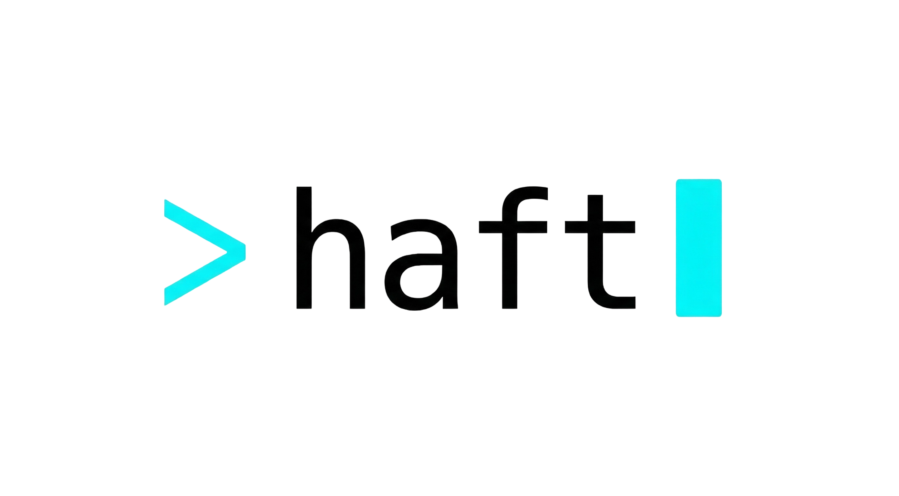

<p align="center">
  <picture>
    <source media="(prefers-color-scheme: dark)" srcset="assets/logo-dark.png">
    <source media="(prefers-color-scheme: light)" srcset="assets/logo-light.png">
    
  </picture>
</p>

<p align="center">
  <strong>The Spring Boot CLI that Spring forgot to build</strong>
</p>

<p align="center">
  <a href="https://github.com/KashifKhn/haft/releases"></a>
  <a href="https://github.com/KashifKhn/haft/blob/main/LICENSE"></a>
  <a href="https://goreportcard.com/report/github.com/KashifKhn/haft"></a>
</p>

<p align="center">
  <a href="https://kashifkhn.github.io/haft">Documentation</a> ·
  <a href="https://github.com/KashifKhn/haft/releases">Releases</a> ·
  <a href="https://github.com/KashifKhn/haft/issues">Report Bug</a> ·
  <a href="https://github.com/KashifKhn/haft/discussions">Discussions</a>
</p>

---
# Haft - Interactive CLI for Spring Boot
---
<details>
  <summary><strong>Table of Contents</strong></summary>
  <ol>
    <li><a href="#the-problem">The Problem</a></li>
    <li><a href="#the-solution">The Solution</a></li>
    <li><a href="#install">Installation</a></li>
    <li><a href="#quick-start">Quick Start</a></li>
    <li><a href="#features">Features</a></li>
  </ol>
</details>

## The Problem

You start a Spring Boot project with Spring Initializr. Great. Now what?

Every new feature means the same tedious ritual:
- Create `UserEntity.java`
- Create `UserRepository.java`  
- Create `UserService.java`
- Create `UserServiceImpl.java`
- Create `UserController.java`
- Create `UserRequest.java`
- Create `UserResponse.java`
- Create `UserMapper.java`

**8 files. Every. Single. Time.**

Copy-paste from existing code. Fix the class names. Fix the imports. Miss something. Debug. Repeat.

## The Solution

```bash
haft generate resource User
```

Done. All 8 files. Properly structured. **Matching your project's existing patterns.**

<p align="center">
  
</p>

## Intelligent Code Generation

Haft doesn't just generate boilerplate — it **learns from your codebase** and generates code that matches your existing conventions.

### What Haft Detects Automatically

| Detection | What It Does |
|-----------|--------------|
| **Architecture Pattern** | Layered, Feature/Package-by-Feature, Hexagonal, Clean, Modular |
| **Feature Style** | Flat (`user/UserController.java`) vs Nested (`user/controller/UserController.java`) |
| **DTO Naming** | `UserRequest`/`UserResponse` vs `UserDTO` |
| **ID Type** | `Long` vs `UUID` with correct annotations |
| **Lombok Usage** | `@Data`, `@Builder`, `@NoArgsConstructor`, `@AllArgsConstructor` |
| **Mapper Type** | MapStruct, ModelMapper, or manual mapping |
| **Base Entity** | Extends your `BaseEntity` if detected |
| **Validation Style** | Jakarta (`jakarta.validation`) vs Javax (`javax.validation`) |
| **Swagger/OpenAPI** | Adds `@Operation`, `@Tag` annotations if detected |
| **Database Type** | JPA, MongoDB, Cassandra, R2DBC |

### Profile Caching

First run scans your project and caches the profile to `.haft/profile.json`. Subsequent runs are **instant**.

```bash
# First run (~200ms) - scans and caches
haft generate resource User

# Second run (~10ms) - uses cache
haft generate resource Product

# Force re-scan if needed
haft generate resource Order --refresh
```

## Why Haft?

| | Spring Initializr | Haft |
|---|---|---|
| Project Bootstrap | ✅ | ✅ |
| Works Offline | ❌ | ✅ |
| Resource Generation | ❌ | ✅ |
| **Intelligent Detection** | ❌ | ✅ |
| **Architecture Aware** | ❌ | ✅ |
| **Test Generation** | ❌ | ✅ |
| Dependency Management | ❌ | ✅ |
| Interactive TUI | ❌ | ✅ |
| Lifecycle Companion | ❌ | ✅ |

**Haft works completely offline.** No web browser. No internet dependency. Just you and your terminal.

## Install

```bash
curl -fsSL https://raw.githubusercontent.com/KashifKhn/haft/main/install.sh | bash
```
> **Note:** You can inspect the [install.sh](https://github.com/KashifKhn/haft/blob/main/install.sh) script before running it. We prioritize security and transparency.

<details>
<summary><strong>Linux</strong></summary>

```bash
# AMD64
curl -L https://github.com/KashifKhn/haft/releases/latest/download/haft-linux-amd64.tar.gz | tar xz
sudo mv haft-linux-amd64 /usr/local/bin/haft

# ARM64
curl -L https://github.com/KashifKhn/haft/releases/latest/download/haft-linux-arm64.tar.gz | tar xz
sudo mv haft-linux-arm64 /usr/local/bin/haft
```

</details>

<details>
<summary><strong>macOS</strong></summary>

```bash
# Intel
curl -L https://github.com/KashifKhn/haft/releases/latest/download/haft-darwin-amd64.tar.gz | tar xz
sudo mv haft-darwin-amd64 /usr/local/bin/haft

# Apple Silicon
curl -L https://github.com/KashifKhn/haft/releases/latest/download/haft-darwin-arm64.tar.gz | tar xz
sudo mv haft-darwin-arm64 /usr/local/bin/haft
```

</details>

<details>
<summary><strong>Windows</strong></summary>

```powershell
Invoke-WebRequest -Uri "https://github.com/KashifKhn/haft/releases/latest/download/haft-windows-amd64.zip" -OutFile "haft.zip"
Expand-Archive -Path "haft.zip" -DestinationPath "."
Move-Item "haft-windows-amd64.exe" "$env:LOCALAPPDATA\Microsoft\WindowsApps\haft.exe"
```

Or download manually from [Releases](https://github.com/KashifKhn/haft/releases).

</details>

<details>
<summary><strong>Go</strong></summary>

```bash
go install github.com/KashifKhn/haft/cmd/haft@latest
```

</details>

<details>
<summary><strong>From Source</strong></summary>

```bash
git clone https://github.com/KashifKhn/haft.git
cd haft
make build
sudo mv bin/haft /usr/local/bin/
```

</details>

<details>
<summary><strong>Shell Completions</strong></summary>

Enable tab completions for your shell:

```bash
# Bash
haft completion bash > /etc/bash_completion.d/haft

# Zsh
haft completion zsh > "${fpath[1]}/_haft"

# Fish
haft completion fish > ~/.config/fish/completions/haft.fish

# PowerShell
haft completion powershell > haft.ps1
```

</details>

## Quick Start

### Create a New Project

```bash
haft init
```

An interactive wizard guides you through project setup:

```
? Project name: my-api
? Group ID: com.example  
? Java version: 21
? Spring Boot: 3.4.1
? Dependencies: web, data-jpa, lombok, validation
```

### Generate Resources (Smart Mode)

```bash
cd my-app

# Generate a complete CRUD resource
# Haft automatically detects your architecture and conventions
haft generate resource User
```

**Generated files match your project structure:**

```
# If your project uses Feature/Package-by-Feature (flat style):
user/
├── UserController.java
├── UserService.java
├── UserServiceImpl.java
├── UserRepository.java
├── User.java
├── UserMapper.java
└── dto/
    ├── UserRequest.java
    └── UserResponse.java

# If your project uses Layered architecture:
controller/UserController.java
service/UserService.java
service/impl/UserServiceImpl.java
repository/UserRepository.java
entity/User.java
dto/UserRequest.java
dto/UserResponse.java
mapper/UserMapper.java
```

### Generate with Tests

```bash
# Generate resource + unit/integration tests
haft generate resource Product

# Skip test generation
haft generate resource Payment --skip-tests
```

**Generated test files:**

```
# ServiceTest - Unit tests with Mockito
# ControllerTest - Integration tests with MockMvc
# RepositoryTest - Integration tests with @DataJpaTest
# EntityTest - Unit tests for entity
```

### Individual Generators

```bash
haft generate controller Product   # haft g co Product
haft generate service Order        # haft g s Order
haft generate repository Payment   # haft g repo Payment
haft generate entity Customer      # haft g e Customer
haft generate dto Invoice          # Request + Response DTOs
```

### Generate Security Configuration

```bash
# Interactive selection of security types
haft generate security

# Generate JWT authentication
haft generate security --jwt

# Generate session-based authentication
haft generate security --session

# Generate OAuth2 authentication (Google, GitHub, Facebook)
haft generate security --oauth2

# Generate all security types
haft generate security --all
```

**Generated files for JWT:**
```
security/
├── SecurityConfig.java
├── JwtUtil.java
├── JwtAuthenticationFilter.java
├── AuthenticationController.java
├── CustomUserDetailsService.java
└── dto/
    ├── AuthRequest.java
    ├── AuthResponse.java
    ├── RegisterRequest.java
    └── RefreshTokenRequest.java
```

### Manage Dependencies

```bash
# Interactive search picker
haft add

# Browse by category
haft add --browse

# Add using shortcuts (330+ available)
haft add lombok validation jwt

# Add using Maven coordinates (auto-verified)
haft add org.mapstruct:mapstruct

# Remove dependencies
haft remove lombok
haft remove   # Interactive picker
```

### Development Workflow

```bash
haft dev serve   # Start with hot-reload
haft dev build   # Build project
haft dev test    # Run tests
haft dev clean   # Clean artifacts
```

### Project Analysis

```bash
haft info              # Project information
haft info --loc        # With lines of code
haft routes            # List REST endpoints
haft routes --files    # With file locations
haft stats             # Code statistics
haft stats --cocomo    # COCOMO cost estimates
```

## Features

- **Intelligent Detection** — Learns from your codebase patterns
- **Architecture Aware** — Supports Layered, Feature, Hexagonal, Clean, Modular
- **Test Generation** — Unit and integration tests with Mockito, MockMvc
- **Profile Caching** — Instant subsequent runs with `.haft/profile.json`
- **Interactive TUI** — Beautiful terminal interface with keyboard navigation
- **Offline First** — No internet required, all metadata bundled
- **Smart Defaults** — Sensible defaults that match industry standards
- **Back Navigation** — Made a mistake? Press `Esc` to go back
- **Dependency Search** — Find any dependency with `/`
- **Maven Central Verification** — Auto-verify and fetch latest versions

## Keyboard Shortcuts

| Key | Action |
|-----|--------|
| `↑` `↓` | Navigate |
| `Enter` | Select |
| `Esc` | Go back |
| `Space` | Toggle |
| `/` | Search |
| `Tab` | Next category |
| `0-9` | Jump to category |

## Supported Architectures

Haft automatically detects and generates code for:

| Architecture | Description |
|--------------|-------------|
| **Layered** | Traditional `controller/`, `service/`, `repository/`, `entity/` |
| **Feature** | Package-by-feature with nested or flat structure |
| **Hexagonal** | Ports & Adapters with `adapter/`, `application/`, `domain/` |
| **Clean** | Clean Architecture with `usecase/`, `gateway/`, `infrastructure/` |
| **Modular** | Modular monolith with `api/`, `internal/` |

## Roadmap

- [x] Project initialization wizard
- [x] All Spring Initializr dependencies  
- [x] Maven & Gradle support
- [x] Intelligent architecture detection
- [x] Test generation
- [x] Profile caching
- [x] `haft generate resource` — Full CRUD generation
- [x] `haft add` / `haft remove` — Dependency management
- [x] `haft dev` — Development commands
- [x] `haft info` / `haft routes` / `haft stats` — Project analysis
- [x] Shell completions (bash, zsh, fish, powershell)
- [x] Security configuration (JWT, Session, OAuth2)
- [x] Custom templates
- [ ] Neovim integration
- [ ] VS Code extension
- [ ] IntelliJ plugin

## Built With

* **[Go](https://go.dev/)** - High-performance compiled binary.
* **[Bubble Tea](https://github.com/charmbracelet/bubbletea)** - The TUI framework.
* **[Cobra](https://github.com/spf13/cobra)** - CLI command structure.

## Contributing

Contributions are welcome. See [CONTRIBUTING.md](CONTRIBUTING.md) for guidelines.


## License

MIT License. See [LICENSE](LICENSE) for details.

---

<p align="center">
  <sub>Built for developers who value their time</sub>
</p>
